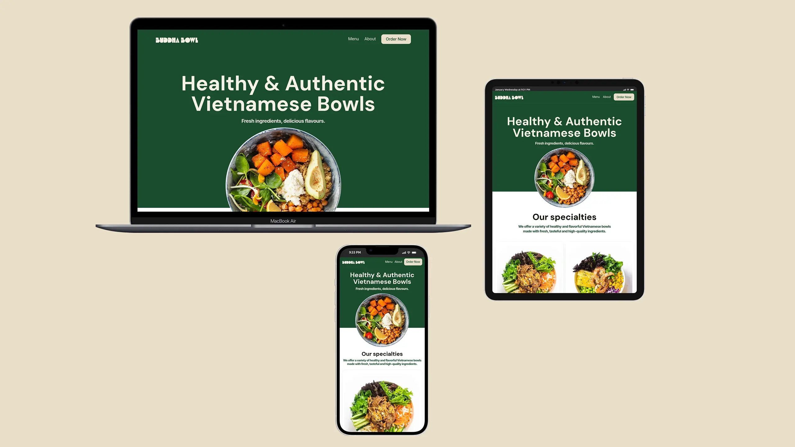

# Buddha Bowl

**Role:**  
Front-End Developer | Responsive Design | UI/UX | JavaScript Interactivity 

🌐 [View Live Project](https://oleksandrmul.github.io/buddha-bowl/)

---

## Overview  
Buddha Bowl is a **responsive three-page website** created for a small Vietnamese food business based in London. The project focuses on clean visuals, clarity, and usability, presenting menu categories in a simple and intuitive way while supporting SEO through a multi-page structure.

---

## Key Achievements  
- ✅ Built a **fully responsive, mobile-first website** optimized for all devices.  
- ✅ Implemented **menu tabs** to switch between Pork, Seafood, and Vegan categories, improving usability and saving space.  
- ✅ Added **interactive hover states** across navigation, buttons, and menu cards.  
- ✅ Integrated **Google Maps iframe** to help customers easily find the restaurant location.  
- ✅ Developed a **newsletter subscription form** with email validation for promotions and updates.  
- ✅ Applied **subtle scroll-based micro-animations** to enhance content flow without distracting users.  
- ✅ Ensured full **accessibility support**, semantic HTML, and performance optimization.  
- ✅ Implemented a **preloader** for a smooth loading experience.

---

## Outcome  
The result is a **lightweight, SEO-friendly, and user-focused website** that clearly presents menu options and helps customers quickly find information, explore dishes, and locate the restaurant.

---

## Conclusions  
This project highlights my ability to create **clean, business-oriented websites** with a strong focus on usability, accessibility, and responsive behavior.

If you’re looking for a developer who can deliver **simple, elegant, and effective web solutions**, I’d be happy to collaborate.
